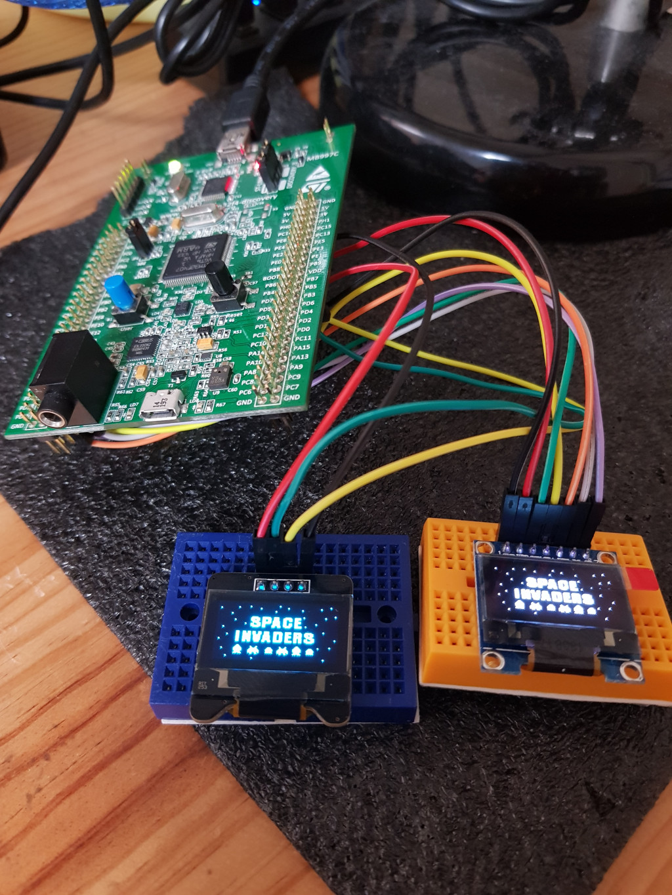

# STM32_HAL_U8G2_OLED
Port of U8G2 Library for STM32 HAL

Reference : https://github.com/olikraus/u8g2 <br>
This is a port of u8g2 library written by olikraus. <br>

I followed a porting guide from https://github.com/olikraus/u8g2/wiki/Porting-to-new-MCU-platform <br>
Only change I made was writing callback functions for I2C, SPI and delay like below.<br>
<br>
I tested it on STM32F4-DISCO board and it worked for both interfaces.<br>
<br>
<br>
<br>
[u8g2_stm32f4.c]
```
#include "main.h"
#include "stm32f4xx_hal.h"
#include "u8g2/u8g2.h"

#define DEVICE_ADDRESS 	0x3C
#define TX_TIMEOUT		100

extern SPI_HandleTypeDef hspi2;
extern I2C_HandleTypeDef hi2c1;

uint8_t u8x8_stm32_gpio_and_delay(u8x8_t *u8x8, uint8_t msg, uint8_t arg_int, void *arg_ptr)
{
	/* STM32 supports HW SPI, Remove unused cases like U8X8_MSG_DELAY_XXX & U8X8_MSG_GPIO_XXX */
	switch(msg)
	{
	case U8X8_MSG_GPIO_AND_DELAY_INIT:
		/* Insert codes for initialization */
		break;
	case U8X8_MSG_DELAY_MILLI:
		/* ms Delay */
		HAL_Delay(arg_int);
		break;
	case U8X8_MSG_GPIO_CS:
		/* Insert codes for SS pin control */
		HAL_GPIO_WritePin(OLED_CS_GPIO_Port, OLED_CS_Pin, arg_int);
		break;
	case U8X8_MSG_GPIO_DC:
		/* Insert codes for DC pin control */
		HAL_GPIO_WritePin(OLED_DC_GPIO_Port, OLED_DC_Pin, arg_int);
		break;
	case U8X8_MSG_GPIO_RESET:
		/* Insert codes for RST pin control */
		HAL_GPIO_WritePin(OLED_RST_GPIO_Port, OLED_RST_Pin, arg_int);
		break;
	}
	return 1;
}

uint8_t u8x8_byte_stm32_hw_spi(u8x8_t *u8x8, uint8_t msg, uint8_t arg_int, void *arg_ptr)
{
	switch(msg) {
	case U8X8_MSG_BYTE_SEND:
		/* Insert codes to transmit data */
		if(HAL_SPI_Transmit(&hspi2, arg_ptr, arg_int, TX_TIMEOUT) != HAL_OK) return 0;
		break;
	case U8X8_MSG_BYTE_INIT:
		/* Insert codes to begin SPI transmission */
		break;
	case U8X8_MSG_BYTE_SET_DC:
		/* Control DC pin, U8X8_MSG_GPIO_DC will be called */
		u8x8_gpio_SetDC(u8x8, arg_int);
		break;
	case U8X8_MSG_BYTE_START_TRANSFER:
		/* Select slave, U8X8_MSG_GPIO_CS will be called */
		u8x8_gpio_SetCS(u8x8, u8x8->display_info->chip_enable_level);
		HAL_Delay(1);
		break;
	case U8X8_MSG_BYTE_END_TRANSFER:
		HAL_Delay(1);
		/* Insert codes to end SPI transmission */
		u8x8_gpio_SetCS(u8x8, u8x8->display_info->chip_disable_level);
		break;
	default:
		return 0;
	}
	return 1;
}

uint8_t u8x8_byte_stm32_hw_i2c(u8x8_t *u8x8, uint8_t msg, uint8_t arg_int, void *arg_ptr)
{
	/* u8g2/u8x8 will never send more than 32 bytes between START_TRANSFER and END_TRANSFER */
	static uint8_t buffer[32];
	static uint8_t buf_idx;
	uint8_t *data;

	switch(msg)
	{
	case U8X8_MSG_BYTE_SEND:
		data = (uint8_t *)arg_ptr;
		while( arg_int > 0 )
		{
			buffer[buf_idx++] = *data;
			data++;
			arg_int--;
		}
		break;
	case U8X8_MSG_BYTE_INIT:
		/* add your custom code to init i2c subsystem */
		break;
	case U8X8_MSG_BYTE_SET_DC:
		break;
	case U8X8_MSG_BYTE_START_TRANSFER:
		buf_idx = 0;
		break;
	case U8X8_MSG_BYTE_END_TRANSFER:
		if(HAL_I2C_Master_Transmit(&hi2c1, (DEVICE_ADDRESS << 1), buffer, buf_idx, TX_TIMEOUT) != HAL_OK) return 0;
		break;
	default:
		return 0;
	}
	return 1;
}
```
